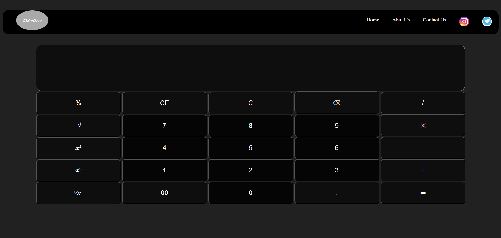

# Dark Themed Calculator UI

A stylish and functional calculator user interface built using HTML and CSS. This project focuses on UI design with dark mode aesthetics, without JavaScript logic or responsive layout.

## 🔧 Tech Stack
- HTML
- CSS

## ✨ Features
- Dark-themed calculator layout
- Multiple function keys: %, √, x², x³, 1/x
- Clear (C, CE), delete, and double zero (00) buttons
- Grid-based button layout for clean structure
- Static UI (no JavaScript functionality)
- Non-responsive (desktop only)

## 📸 Screenshot


## 🚀 How to Use
1. Clone the repository:
   ```bash
   git clone https://github.com/yashgupta7373/Calculator-In-HTML-CSS.git
Open index.html in your browser.

🔗 Live Demo
👉 View Project https://yashgupta7373.github.io/Calculator-In-HTML-CSS/

📌 Note
This is a front-end design prototype only. Functionality and responsiveness may be added in future versions.